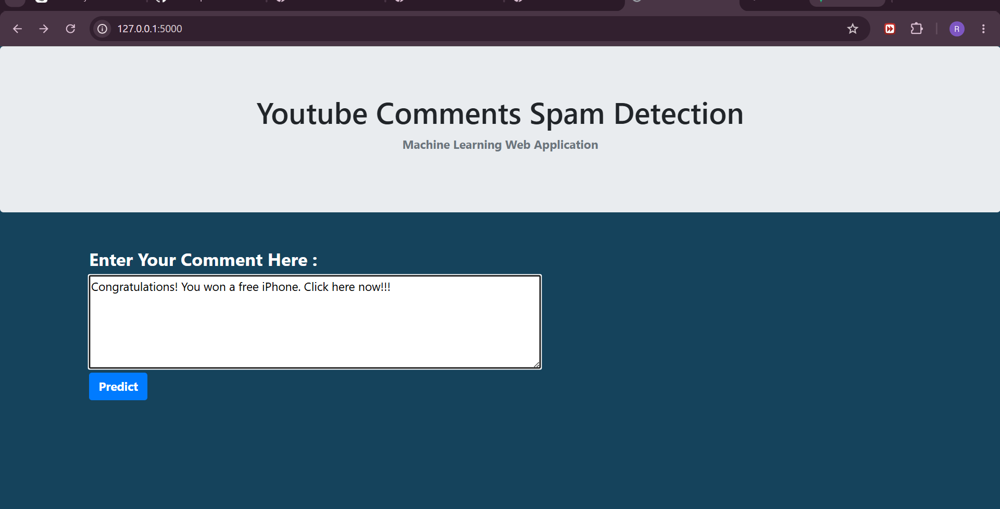
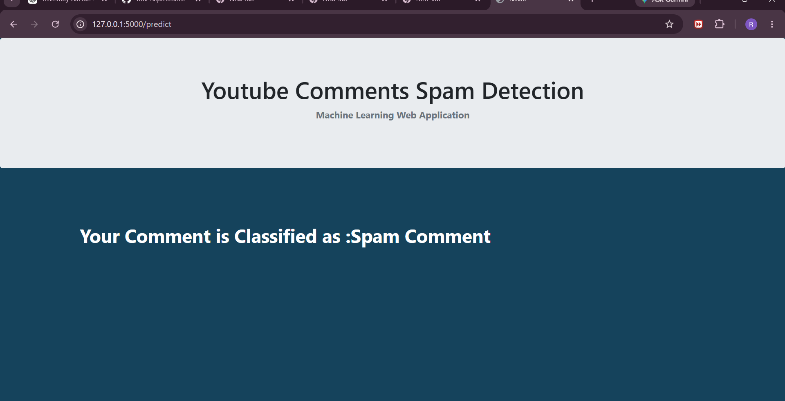

# Spam Detection for YouTube Comments

## Overview

Spam comments on YouTube often contain promotional content, misleading information, or unwanted links. This project is a Machine Learning-based web application that detects whether a YouTube comment is Spam or Not Spam.

The application uses Natural Language Processing (NLP) techniques and a Multinomial Naive Bayes classifier to analyze comments and provide real-time predictions through a Flask web interface.

## Features

* Detects Spam and Non-Spam YouTube comments
* NLP-based text preprocessing
* Feature extraction using CountVectorizer
* Multinomial Naive Bayes classification
* Flask web application interface
* Real-time prediction results

## Project Screenshots

### 🏠 Home Page



This is the main interface where user enters a YouTube comment for prediction.

---

### 🚨 Spam Detection Result



The model predicts whether the entered comment is Spam or Not Spam.

## Technologies Used

* Python
* Flask
* Scikit-learn
* Pandas
* NumPy
* HTML
* CSS
* Bootstrap
* Natural Language Processing (NLP)

## Project Structure

```text
spam-detection-for-youtube-comments/
│
├── app.py
├── requirements.txt
├── Procfile
├── YoutubeSpamMergedData.csv
├── templates/
│   ├── home.html
│   └── result.html
├── static/
│   └── css/
│       └── styles.css
└── README.md
```

## How It Works

1. User enters a YouTube comment.
2. Text is transformed into numerical features using CountVectorizer.
3. The Multinomial Naive Bayes model processes the input.
4. The application predicts whether the comment is Spam or Not Spam.
5. The result is displayed on the web page.

## Installation

```bash
pip install -r requirements.txt
python app.py
```

## Future Improvements

* Implement XGBoost-based classification
* Improve model accuracy with advanced NLP techniques
* Deploy on cloud platforms
* Add model persistence using Pickle/Joblib

## Author

Rahul Mancharla
